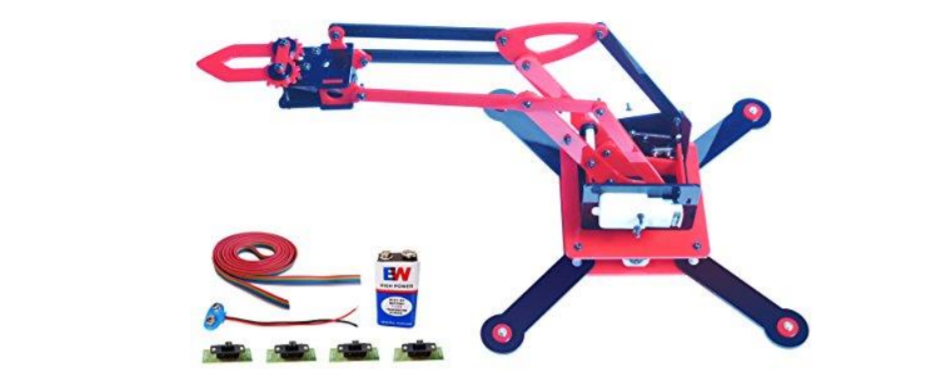
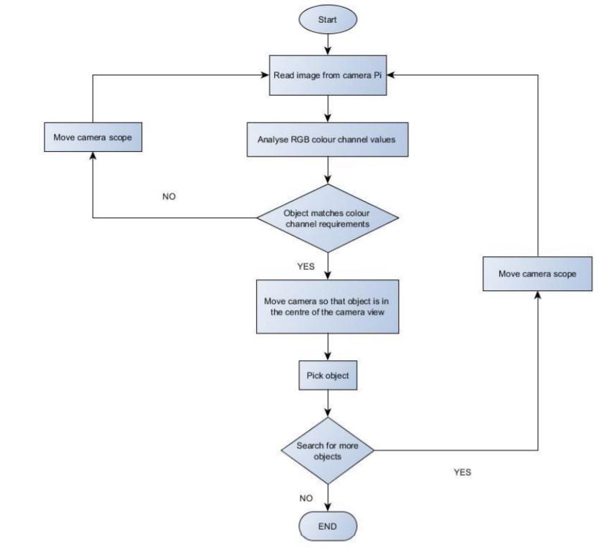
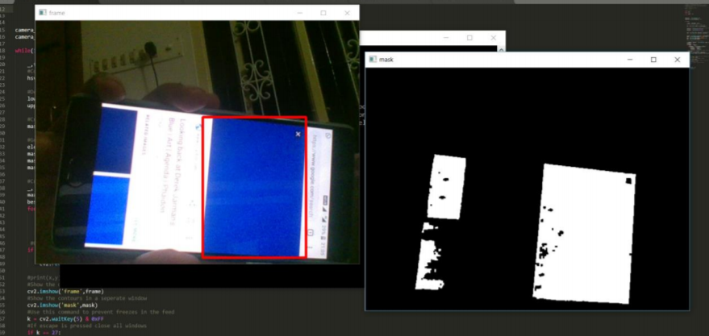
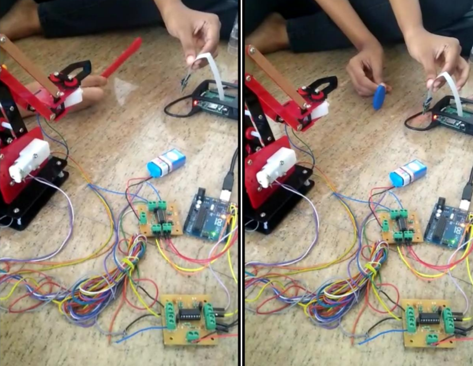
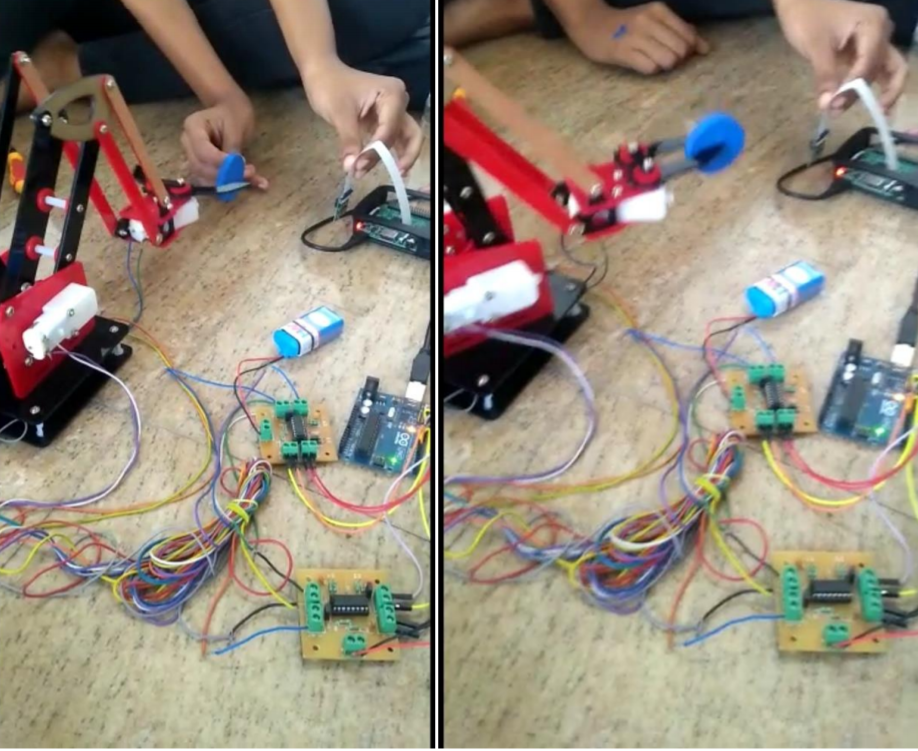

# Robotic-sorting-arm-for-colored-objects
A robotic arm that sorts objects based on colors, implemented for the color blue.

## Hardware Needed: 
* Base Acrylic Platform (15.5 X 10.0 cm)
* Top Acrylic Platform (13.4 X 7.5 cm)
* Acrylic parts for gripper and lift module
* Screw, Nut-bolts set Spacer , Stud Set
* 2 B.O. Motors (L- Shape and Straight)
* 2 Wheels (7.5cm Dia)
* 8 Fitting clamps, 1 Caster 
* Raspberry pi microcontroller
* Arduino microcontroller
* Pi cam

## Software needed:
* Python --Opencv
* Arduino

## Implementation: 

## Results:

* For image processing and color detection:

* For pick and place robot

